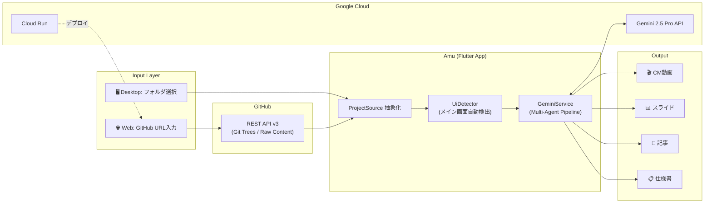
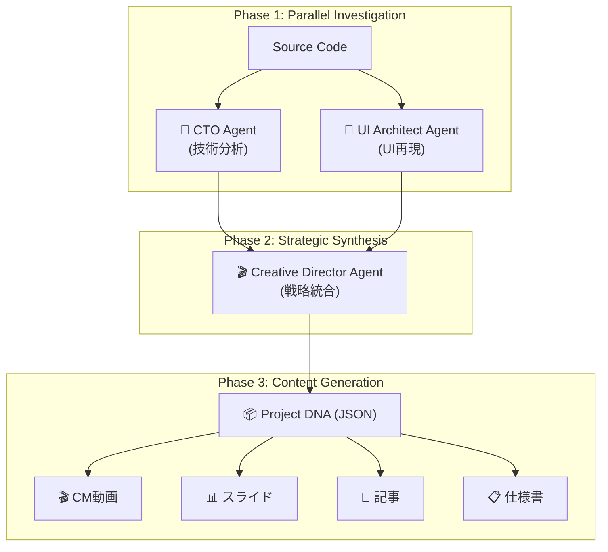

:::message
**対象読者**: 個人開発でプロダクトを作っているが、広報資料（動画・スライド・記事）の作成に時間を奪われているFlutter/Dart開発者。もしくはGemini APIのMulti-Agent設計パターンに興味があるエンジニア。

**得られる知識**: Gemini 2.5 ProによるMulti-Agent並列パイプラインの設計・実装方法、GitHubリポジトリをWeb上で直接解析する `ProjectSource` 抽象化パターン、プロンプトエンジニアリングの実践的テクニック。
:::


## Pain: ドキュメントは地獄だ

コードを書くのは好きだ。ロジックを組み立て、問題を解決し、ゼロから何かを創り出す。このプロセスには純粋な喜びがある。だが、その後に待ち受ける**ドキュメント作成という名の地獄**は、どうだ。

- **README.md**: プロジェクトの顔だが、一度書いたら最後、コードの進化に追従できず、すぐに骸骨と化す。
- **技術ブログ**: 書けば評価されるのは分かっている。だが、苦労して実装したロジックを、今度は日本語に「翻訳」する気力がどこにある？
- **プレゼン／CM動画**: 同じ技術を、今度は非エンジニアにも分かるようなビジュアルにする。もはや**別の職種**だ。

「コードは雄弁に語る」とは言うが、残念ながらほとんどの人間はコードを読めない。俺たちの創造物は、ドキュメントという退屈な通訳を介さなければ、その真価を誰にも理解してもらえない。この翻訳作業が、俺たちの時間を、情熱を、創造性を食い潰していく。

もう我慢の限界だった。

## Goal: GitHubのURLだけで、物語が生まれる世界

理想はこうだ。

```
https://github.com/your/awesome-project
```

このURLを入力するだけで、ソースコードから必要な広報資産一式が自動で生成される世界。

| 資産 | 説明 |
|---|---|
| 🎬 **Amu CM** | プロダクト紹介動画（ストーリーボード＋レンダリング） |
| 📊 **Auto Slide** | Marp互換プレゼンテーションスライド |
| 📝 **Chronicler Article** | Zenn向け技術記事 |
| 📋 **Master Spec** | 技術面接対応のプロダクトFAQ |

開発者はコードを書くことに集中する。プロジェクトが紡ぐべき物語は、AIが勝手に編纂してくれる。そんな未来を夢見た。

## Solution: Multi-Agent AI「Amu」の召喚

この退屈という悪魔を倒すため、AIツール「**Amu（アム）**」を錬成することにした。シェルスクリプトで十分？ 笑わせるな。これは単なるテキスト生成じゃない。**プロジェクトの魂を抽出し、4種のコンテンツに再構成する**という、もっと高尚な儀式だ。

### システム全体像

まずはAmuの全体アーキテクチャを俯瞰しよう。



コアとなる頭脳にはGoogleの **Gemini 2.5 Pro** を選んだ。ただし、1回のAPI呼び出しで全てをやらせる「一極集中」ではない。**3つの専門エージェントが並列で動作する Multi-Agent 設計**を採用した。

### Multi-Agent パイプライン



なぜ Multi-Agent か？ **1つのプロンプトに全部詰め込んだら、品質が崩壊した**からだ。これは後述する。

## Implementation: 悪魔との契約

### 1. 最初の失敗：「全部入りプロンプト」の崩壊

最初のバージョンでは、こう考えていた。

> 「Gemini 2.5 Proはコンテキストウィンドウが広いんだから、ソースコード全部＋全指示を1プロンプトに入れれば、一発で完璧なJSON返るでしょ」

**甘かった。**

返ってきたJSONは、技術分析は雑、UIの色は全部 `#333333`、キャッチコピーは「素晴らしいアプリです」。コンテキストが広くても、**「何に集中すべきか」が曖昧だと、AIは平均的な出力しか返さない**。人間のチームと同じだ。全員が「なんとなく全体を見る」会議は、何も決まらない。

**教訓**: コンテキストウィンドウの大きさと、出力の質は別問題。

### 2. 解決策：3エージェント並列パイプライン

そこで、責務を明確に分離した。

```dart
// GeminiService.analyzeProject() のコア部分
// Phase 1: 2つの専門AIが「同時に」ソースコードを分析
final results = await Future.wait([
  _generateJson(ctoPrompt, temperature: 0.2),   // CTO Agent
  _generateJson(uiPrompt, temperature: 0.2),     // UI Architect Agent
]);

final ctoData = results[0];  // 技術分析結果
final uiData = results[1];   // UI再現結果

// Phase 2: Creative Director が両者の成果を統合
final masterPlan = await _generateJson(masterPrompt, temperature: 0.7);
```

**🔬 Agent A: CTO（技術分析）** — `temperature: 0.2`（冷徹に事実を抽出）
```json
{
  "product_name": "string",
  "app_type": "dashboard | feed | chat | tool | game",
  "tech_stack": ["Flutter", "Dart", "Gemini API"],
  "core_features": ["..."],
  "qa_context": {
    "core_question": "string",
    "core_answer": "string",
    "technical_highlight": "string"
  }
}
```

**🎨 Agent B: UI Architect（UI再現）** — `temperature: 0.2`（正確にWidget Treeを再構築）
ここが一番クレイジーな部分だ。ソースコードからFlutter/React/Vue/HTMLのUI構造を読み取り、**実際にFlutterでレンダリング可能なWidget Tree JSON**に変換する。

```json
{
  "brandPalette": {
    "background": "#0F172A",
    "primary": "#6366F1",
    "secondary": "#EC4899"
  },
  "widget_tree": {
    "type": "Scaffold",
    "body": {
      "type": "Column",
      "children": [...]
    }
  }
}
```

**🎬 Agent C: Creative Director（戦略統合）** — `temperature: 0.7`（創造性を解放）
CTO と UI Architect の分析を受け取り、CM動画の脚本、スライド構成、記事コンテキスト、マーケティングコピーを一気に生成する。

```dart
final masterPrompt = '''
Role: Creative Director & Product Strategist.
Input Data:
- Product: ${ctoData['product_name']} (${ctoData['app_type']})
- Stack: ${ctoData['tech_stack']}
- Features: ${ctoData['core_features']}
- UI Style: ${uiData['brandPalette']}
- Technical Fact (Q&A): ${ctoData['qa_context']}
- Available Image Assets: ${assets.join(', ')}

Task: Generate a Master Plan for the product launch.
''';
```

**なぜ `temperature` を変えているのか？** CTO と UI Architect は「事実の抽出」が仕事だ。幻覚（ハルシネーション）は致命的なので、低温（0.2）で抑制する。一方、Creative Director は「面白いコピーを書く」のが仕事だから、0.7で創造性を解放する。**同じモデルでも、役割に応じて温度を変える**のが Multi-Agent 設計のキモだ。

### 3. もう一つの失敗：`dart:io` の壁

Amuは元々macOSデスクトップアプリとして開発した。ローカルフォルダをドラッグ＆ドロップしてソースコードを読み取る仕組みだ。

しかし、**ハッカソンにはWeb版のデプロイが必要**だった。

ここで問題が発生する。Flutterの `dart:io` ライブラリ（ファイル読み書き）は、**ブラウザ上では動かない**。ブラウザにはファイルシステムが存在しないからだ。

「Web版ではGitHub APIからソースコードを取得すればいいじゃないか」

そう、答えは簡単だった。だが、既存のコードベースの至る所に `File(path).readAsString()` が散りばめられている。これを全部書き換えるのか？

**解決策**: `ProjectSource` 抽象化パターン。

```dart
/// ファイルアクセスの抽象インターフェース
abstract class ProjectSource {
  Future<List<String>> getFilePaths();
  Future<String> readFile(String path);
}

/// Web版: GitHub API経由でリポジトリを読み取る
class GitHubProjectSource implements ProjectSource {
  final String owner;
  final String repo;
  
  // URL → 自動パース
  static GitHubProjectSource? fromUrl(String url) {
    final uri = Uri.parse(url);
    if (uri.host != 'github.com') return null;
    final segments = uri.pathSegments.where((s) => s.isNotEmpty).toList();
    if (segments.length < 2) return null;
    return GitHubProjectSource(owner: segments[0], repo: segments[1]);
  }

  @override
  Future<List<String>> getFilePaths() async {
    // GitHub Git Trees API でファイル一覧を再帰取得
    final apiUrl = Uri.parse(
      'https://api.github.com/repos/$owner/$repo/git/trees/main?recursive=1'
    );
    final response = await http.get(apiUrl);
    final tree = jsonDecode(response.body)['tree'] as List;
    return tree
        .where((node) => node['type'] == 'blob')
        .map((node) => node['path'] as String)
        .toList();
  }

  @override
  Future<String> readFile(String path) async {
    // raw.githubusercontent.com はAPI制限が緩い
    final rawUrl = Uri.parse(
      'https://raw.githubusercontent.com/$owner/$repo/main/$path'
    );
    return (await http.get(rawUrl)).body;
  }
}
```

これにより、`GeminiService` は `ProjectSource` というインターフェースだけに依存する。ローカルだろうがGitHubだろうが、同じコードで動く。

```dart
// Desktop版
final source = LocalProjectSource('/path/to/project');

// Web版（GitHub URL入力）
final source = GitHubProjectSource.fromUrl('https://github.com/user/repo')!;

// どちらも同じメソッドで解析
final dna = await geminiService.analyzeProject(source);
```

**教訓**: 抽象化は「将来のために」ではなく、**「今ある制約を突破するために」** やるべきだ。

### 4. UI自動検出：ポリグロット対応

AmuはFlutterプロジェクトだけでなく、React、Vue、素のHTMLプロジェクトも解析できる。`UiDetector` がメイン画面のファイルを自動検出する。

```dart
class UiDetector {
  Future<String?> findMainScreenPath(ProjectSource source) async {
    final allPaths = await source.getFilePaths();

    // Priority 1: Flutter → lib/main.dart → home: ウィジェットを追跡
    // Priority 2: React  → src/App.tsx
    // Priority 3: Vue    → src/App.vue  
    // Priority 4: Web    → index.html
    
    // Flutterの場合、main.dartの `home: MyHomePage()` を正規表現で追跡し、
    // 実際のUI定義ファイルまで辿る
    final homeRegex = RegExp(r'home:\s*(?:const\s+)?([A-Z]\w+)\(');
    // ...
  }
}
```

`main.dart` の `home: MyHomePage()` から `MyHomePage` クラスの定義ファイルを自動検出し、そのUIコードを UI Architect Agent に渡す。これにより、エントリーポイントではなく**実際の画面定義**が解析される。

### 5. ファイルフィルタリング：トークンを無駄にしない

50ファイルのソースコードを全部Geminiに投げると、テストコードやビルド成果物もノイズとして混入する。そこで、優先度ベースのフィルタリングを実装した。

```dart
for (var p in allPaths) {
  final lower = p.toLowerCase();
  // ノイズを除外
  if (lower.contains('test/') || lower.contains('.dart_tool/') || 
      lower.contains('build/') || lower.contains('.git/')) continue;
  
  // 優先度の高いファイルを先頭に
  if (lower.endsWith('pubspec.yaml')) {
    priorityPaths.insert(0, p);      // 設定ファイルは最優先
  } else if (lower.endsWith('main.dart')) {
    priorityPaths.add(p);            // エントリーポイント
  } else if (lower.contains('/models/') || lower.contains('/ui/')) {
    priorityPaths.add(p);            // コアロジック
  } else {
    otherPaths.add(p);               // その他
  }
}

// 上位50ファイルだけをGeminiに送信
final totalPaths = [...priorityPaths, ...otherPaths].take(50).toList();
```

**なぜ50ファイル？** Gemini 2.5 Proのコンテキストウィンドウは広いが、ファイル数が増えるほどレスポンスが遅くなり、JSONフォーマットが崩れる確率も上がる。50ファイル × 平均5KBで約250KBのコンテキスト。この辺が「品質と速度のスイートスポット」だった。

## Result: GitHub URLを入れるだけ

@[youtube](maxRawsdCHE)

### Before:
無数のファイルが散らばる、混沌としたソースコードの海。そして誰にも更新されず、化石となった `README.md`。

### After:
GitHub URLを入力 → **30秒** → CM動画のストーリーボード、Marpスライド、Zenn記事、技術FAQ、すべてが自動生成される。


## ハマりポイント集（Time Saver）

これからGeminiでMulti-Agentを組む人のために、俺が踏んだ地雷を共有しておく。

### 1. GeminiはJSON出力を「たまに」壊す
````markdown
期待: `{"name": "Amu"}`
現実: ```json\n{"name": "Amu"}\n```
````
Geminiは親切にもMarkdownのコードブロックで包んでくることがある。対策として、レスポンスからフェンスを除去するパーサーを挟んだ。

```dart
final jsonStr = text
    .replaceAll(RegExp(r'^```json\s*', multiLine: true), '')
    .replaceAll(RegExp(r'^```\s*$', multiLine: true), '')
    .trim();
```

### 2. `temperature` の罠
CTO Agent に `temperature: 0.7` を設定したら、存在しないライブラリ名を自信満々に返してきた。**事実抽出系のエージェントは `0.1〜0.3` が鉄則。**

### 3. Firebase プロジェクトIDにアンダースコアは使えない
`amu_cm_director` → ❌
`amu-cm-director` → ⭕

公式ドキュメントには小さく書いてあるが、CLIのエラーメッセージからは全く分からない。30分溶かした。

### 4. Web版での `dart:io` 
`import 'dart:io';` が1箇所でも残っていると、`flutter build web` は黙って失敗する。条件付きインポートで対処。

```dart
import 'dart:io' if (dart.library.html) 'dart:io';
```

## 技術スタック

| 技術 | 用途 |
|---|---|
| **Flutter / Dart** | クロスプラットフォームUI（Desktop + Web） |
| **Gemini 2.5 Pro** | Multi-Agent コード解析 & コンテンツ生成 |
| **GitHub REST API** | Web版：リポジトリからソースコード取得 |
| **Cloud Run** | Webアプリのデプロイ（nginx:alpine コンテナ） |
| **google_generative_ai** | Gemini API Dartクライアント |
| **http** | GitHub API / raw content 取得 |

## まとめ

Amuを作って分かったことがある。

Multi-Agentの本質は「AIを増やすこと」ではなく、**「AIに明確な役割を与えること」**だ。曖昧な指示で100万トークンを投げても、質の高いアウトプットは得られない。人間のチームビルディングと同じで、**責務を分割し、専門性を尊重し、最後に統合する**。これが答えだった。

そして、`ProjectSource` という抽象化が教えてくれたのは、**制約はイノベーションの母**だということ。Web版が必要というハッカソンの制約が、結果としてGitHubリポジトリを直接解析するという、デスクトップ版よりも便利な機能を生み出した。

俺たちはコードを書く。
それだけで、物語は生まれる。

**Amu**が、そのすべてを現実にした。
